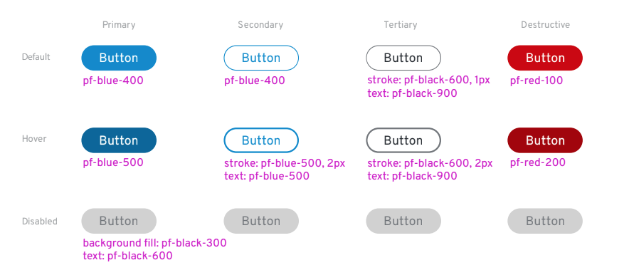
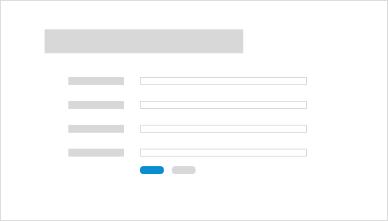
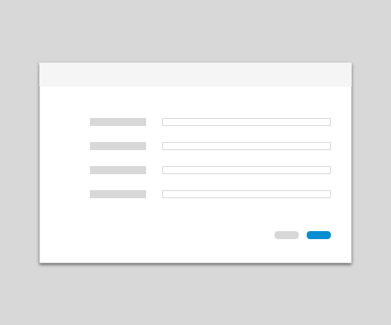

# Buttons
Buttons communicate and trigger actions a user can take throughout an experience.

## Usage
A button should represent an action a user can take, like submitting a form, cancelling a process, or creating a new object. When the user clicks the button, the associated action should be performed immediately.

### Button Types
Use different button types to build hierarchy in an application layout.

#### Primary
Use primary buttons for the main action you want a user to take on a page. In general, try to limit primary buttons to one per page.

#### Secondary
Use secondary buttons for secondary actions a user can take. For example, a cancel button would be secondary to a submit button on a form or modal.

#### Tertiary
Use tertiary buttons for any action a user can take on a page that is not primary or secondary. For example, actions a user might take to edit items in a list could be represented as tertiary buttons.

#### Destructive
Use destructive buttons for actions a user can take that are potentially destructive or difficult/impossible to undo like deleting or removing user data.

### Button States

#### Focused
Use the focused state when a button is in focus via hover, mouse-over, or keyboard navigation.

#### Active
Use the active state to indicate that a user has triggered the button via a mouse-click or by hitting Enter on their keyboard. The button will appear to be pressed.

#### Disabled
Use the disabled state when a button is inactive and a user cannot interact with it.

### How to use buttons in your designs
#### Buttons on full page forms
* Place the primary button to the left of the cancel button.
* Align submit buttons with left-edge of input fields.

#### Buttons on modals
* Align submit buttons to the bottom right of the modal.
* Place the primary button to the right of the cancel button.
* Align submit buttons with right-edge of input fields.

## Content Guidelines
* Button labels should tell the user what will happen with they click a button.
* Always use verbs or verb phrases.
* Use specific labels that clearly describe the user action.
* Aim for short (1-3 words) labels wherever possible.
* Do not use long button labels that might risk wrapping.

See the [PatternFly Terminology and Wording Guidelines](http://www.patternfly.org/styles/terminology-and-wording/) for additional guidance.
