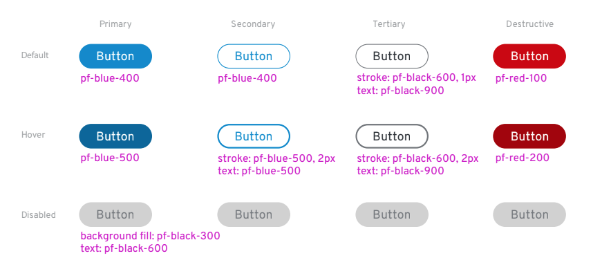
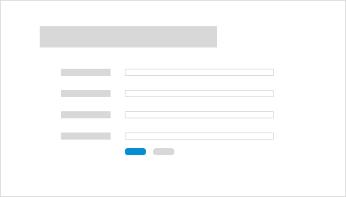

```hbs title=Button-variations
{{#> button button--modifier="pf-m-primary"}}
  Primary
{{/button}}
{{#> button button--modifier="pf-m-secondary"}}
  Secondary
{{/button}}
{{#> button button--modifier="pf-m-tertiary"}}
  Tertiary
{{/button}}
{{#> button button--modifier="pf-m-danger"}}
  Danger
{{/button}}

<br>
<br>

{{#> button button--modifier="pf-m-link"}}
  {{#> button-icon}}
    <i class="fas fa-plus-circle" aria-hidden="true"></i>
  {{/button-icon}}
  Link
{{/button}}
{{#> button button--modifier="pf-m-plain" button--attribute='aria-label="Remove"'}}
  <i class="fas fa-times" aria-hidden="true"></i>
{{/button}}
{{#> button button--modifier="pf-m-inline pf-m-link"}}
  Inline link
{{/button}}

<br>
<br>

{{#> button button--modifier="pf-m-control"}}
  Control
{{/button}}
{{#> button button--modifier="pf-m-control" button--attribute='aria-label="Copy input"'}}
  <i class="fas fa-copy" aria-hidden="true"></i>
{{/button}}
```

```hbs title=Button-states{{#> button button--modifier="pf-m-primary"}}
  Primary
{{/button}}
{{#> button button--modifier="pf-m-primary pf-m-focus"}}
  Primary focus
{{/button}}
{{#> button button--modifier="pf-m-primary pf-m-active"}}
  Primary active
{{/button}}
{{#> button button--modifier="pf-m-primary" button--attribute="disabled"}}
  Primary disabled
{{/button}}
<br><br>
{{#> button button--modifier="pf-m-secondary"}}
  Secondary
{{/button}}
{{#> button button--modifier="pf-m-secondary pf-m-focus"}}
  Secondary focus
{{/button}}
{{#> button button--modifier="pf-m-secondary pf-m-active"}}
  Secondary active
{{/button}}
{{#> button button--modifier="pf-m-secondary" button--attribute="disabled"}}
  Secondary disabled
{{/button}}
<br><br>
{{#> button button--modifier="pf-m-tertiary"}}
  Tertiary
{{/button}}
{{#> button button--modifier="pf-m-tertiary pf-m-focus"}}
  Tertiary focus
{{/button}}
{{#> button button--modifier="pf-m-tertiary pf-m-active"}}
  Tertiary active
{{/button}}
{{#> button button--modifier="pf-m-tertiary" button--attribute="disabled"}}
  Tertiary disabled
{{/button}}
<br><br>
{{#> button button--modifier="pf-m-danger"}}
  Danger
{{/button}}
{{#> button button--modifier="pf-m-danger pf-m-focus"}}
  Danger focus
{{/button}}
{{#> button button--modifier="pf-m-danger pf-m-active"}}
  Danger active
{{/button}}
{{#> button button--modifier="pf-m-danger" button--attribute="disabled"}}
  Danger disabled
{{/button}}
<br><br>
{{#> button button--modifier="pf-m-link"}}
  {{#> button-icon}}
    <i class="fas fa-plus-circle" aria-hidden="true"></i>
  {{/button-icon}}
  Link
{{/button}}
{{#> button button--modifier="pf-m-link pf-m-focus"}}
  {{#> button-icon}}
    <i class="fas fa-plus-circle" aria-hidden="true"></i>
  {{/button-icon}}
  Link focus
{{/button}}
{{#> button button--modifier="pf-m-link pf-m-active"}}
  {{#> button-icon}}
    <i class="fas fa-plus-circle" aria-hidden="true"></i>
  {{/button-icon}}
  Link active
{{/button}}
{{#> button button--modifier="pf-m-link" button--attribute="disabled"}}
  {{#> button-icon}}
    <i class="fas fa-plus-circle" aria-hidden="true"></i>
  {{/button-icon}}
  Link disabled
{{/button}}
<br><br>
{{#> button button--modifier="pf-m-plain" button--attribute='aria-label="Remove"'}}
  <i class="fas fa-times" aria-hidden="true"></i>
{{/button}}
{{#> button button--modifier="pf-m-plain pf-m-focus" button--attribute='aria-label="Remove"'}}
  <i class="fas fa-times" aria-hidden="true"></i>
{{/button}}
{{#> button button--modifier="pf-m-plain pf-m-active" button--attribute='aria-label="Remove"'}}
  <i class="fas fa-times" aria-hidden="true"></i>
{{/button}}
{{#> button button--modifier="pf-m-plain" button--attribute='disabled aria-label="Remove"'}}
  <i class="fas fa-times" aria-hidden="true"></i>
{{/button}}
<br><br>
{{#> button button--modifier="pf-m-link pf-m-inline pf-m-inline"}}
  Inline link
{{/button}}
{{#> button button--modifier="pf-m-link pf-m-focus pf-m-inline"}}
  Inline link focus
{{/button}}
{{#> button button--modifier="pf-m-link pf-m-active pf-m-inline"}}
  Inline link active
{{/button}}
{{#> button button--modifier="pf-m-link pf-m-inline" button--attribute="disabled"}}
  Inline link disabled
{{/button}}
<br><br>
{{#> button button--modifier="pf-m-control"}}
  Control
{{/button}}
{{#> button button--modifier="pf-m-control pf-m-focus"}}
  Control focus
{{/button}}
{{#> button button--modifier="pf-m-control pf-m-active"}}
  Control active
{{/button}}
{{#> button button--modifier="pf-m-control pf-m-expanded"}}
  Control expanded
{{/button}}
{{#> button button--modifier="pf-m-control" button--attribute="disabled"}}
  Control disabled
{{/button}}
```

```hbs title=Links-as-buttons
{{#> button-link button-link--attribute='href="https://www.w3.org/TR/WCAG20-TECHS/ARIA8.html#ARIA8-examples"' button-link--modifier="pf-m-primary"}}
  Primary link to W3.org
{{/button-link}}
{{#> button-link button-link--attribute='href="#overview" aria-label="Read more about button documentation"' button-link--modifier="pf-m-secondary"}}
  Secondary link to anchor
{{/button-link}}
{{#> button-link button-link--attribute='href="https://www.w3.org/TR/WCAG20-TECHS/ARIA8.html#ARIA8-examples" aria-disabled="true" tabindex="-1"' button-link--modifier="pf-m-tertiary pf-m-disabled"}}
  Tertiary link to W3.org
{{/button-link}}
```

```hbs title=Button-block-level
{{#> button button--modifier="pf-m-primary pf-m-block"}}
  Block level button
{{/button}}
```

```hbs title=Button-types
{{#> button button--modifier="pf-m-primary" button--IsSubmit="true"}}
  Submit
{{/button}}

{{#> button button--modifier="pf-m-primary" button--IsReset="true"}}
  Reset
{{/button}}

{{#> button button--modifier="pf-m-primary"}}
  Default
{{/button}}
```

# Documentation
# Buttons
Buttons communicate and trigger actions a user can take throughout an experience.


## Usage
A button should represent an action a user can take, like submitting a form, cancelling a process, or creating a new object. When the user clicks the button, the associated action should be performed immediately.

### Button types
Use different button types to build hierarchy in an application layout.



#### Primary
Use primary buttons for the main action you want a user to take on a page. In general, try to limit primary buttons to one per page.

#### Secondary
Use secondary buttons for secondary actions a user can take. For example, a cancel button would be secondary to a submit button on a form or modal.

#### Tertiary
Use tertiary buttons for any action a user can take on a page that is not primary or secondary. For example, actions a user might take to edit items in a list could be represented as tertiary buttons.

#### Destructive
Use destructive buttons for actions a user can take that are potentially destructive or difficult/impossible to undo like deleting or removing user data.

### Button states

#### Focused
Use the focused state when a button is in focus via hover, mouse-over, or keyboard navigation.

#### Active
Use the active state to indicate that a user has triggered the button via a mouse-click or by hitting Enter on their keyboard. The button will appear to be pressed.

#### Disabled
Use the disabled state when a button is inactive and a user cannot interact with it.

### How to use buttons in your designs
#### Buttons on full page forms
* Place the primary button to the left of the cancel button.
* Align submit buttons with left-edge of input fields.



#### Buttons on modals
* Align submit buttons to the bottom right of the modal.
* Place the primary button to the right of the cancel button.
* Align submit buttons with right-edge of input fields.


## Content guidelines
* Button labels should tell the user what will happen with they click a button.
* Always use verbs or verb phrases.
* Use specific labels that clearly describe the user action.
* Aim for short (1-3 words) labels wherever possible.
* Do not use long button labels that might risk wrapping.

See the [PatternFly terminology and wording guidelines](http://www.patternfly.org/styles/terminology-and-wording/) for additional guidance.

## Overview

Always add a modifier class to add color to the button.

## Button vs link
Semantic buttons and links are important for usability as well as accessibility. Using an `a` instead of a `button` element to perform user initiated actions should be avoided, unless absolutely necessary.

## Accessibility

| Attribute | Applied to | Outcome |
| -- | -- | -- |
| `aria-pressed="true or false"` | `.pf-c-button` | Indicates that the button is a toggle. When set to "true", `pf-m-active` should also be set so that the button displays in an active state. **Required when button is a toggle** |
| `aria-label="[button label text]"` | `.pf-m-plain` | Provides an accessible name for the button when an icon is used instead of text. **Required when icon is used with no supporting text** |
| `aria-label="[link description]"` | `a.pf-c-button` | The link text should adequately describe the link's purpose. If it does not, aria-label can provide more detailed interaction information. |
| `disabled` | `button.pf-c-button` | When a button element is used, indicates that it is unavailable and removes it from keyboard focus. **Required when button is disabled** |
| `aria-disabled="true"` | `a.pf-c-button` | When a link element is used, indicates that it is unavailable. **Required when link is disabled** |
| `tabindex="-1"` | `a.pf-c-button` | When a link element is used, removes it from keyboard focus. **Required when link is disabled** |

## Usage

| Class | Applied to | Outcome |
| -- | -- | -- |
| `.pf-c-button` | `<button>` |  Initiates a button. Always use it with a modifier class. **Required** |
| `.pf-c-button__icon` | `<span>` |  Applies spacing to an icon inside of the button when the icon is followed by text. |
| `.pf-m-primary` | `.pf-c-button` | Modifies for primary styles. |
| `.pf-m-secondary` | `.pf-c-button` | Modifies for secondary styles. |
| `.pf-m-tertiary` | `.pf-c-button` | Modifies for tertiary styles. |
| `.pf-m-danger` | `.pf-c-button` | Modifies for danger styles. |
| `.pf-m-link` | `.pf-c-button` | Modifies for link styles. This button has no background or border and is styled as a link. This button would commonly appear in a form and may include an icon. |
| `.pf-m-plain` | `.pf-c-button` | Modifies for icon styles. This button has no background or border, uses a standard text color, and is used for `.pf-m-plain` icon buttons such as close, expand, kebab, etc. |
| `.pf-m-inline` | `.pf-c-button.pf-m-link` | Modifies for inline styles. This button is presented similar to a normal link, has no padding, and is displayed inline with other inline content. |
| `.pf-m-block` | `.pf-c-button` | Creates a block level button. |
| `.pf-m-control` | `.pf-c-button` | Modifies for control styles. **Note:** This modifier should only be used when using buttons in the Input Group or Clipboard Copy components. |
| `.pf-m-expanded` | `.pf-c-button.pf-m-control` | Modifies a control button for the expanded state. |
| `.pf-m-hover` | `.pf-c-button` | Forces display of the hover state of the button. This state is primarily for demonstration purposes and would not normally be used in lieu of the `:hover` pseudo-class.  |
| `.pf-m-active` | `.pf-c-button` | Forces display of the active state of the button. This state is primarily for demonstration purposes and would not normally be used in lieu of the `:active` pseudo-class.  |
| `.pf-m-focus` | `.pf-c-button` | Forces display of the focus state of the button. This state is primarily for demonstration purposes and would not normally be used in lieu of the `:focus` pseudo-class.  |
